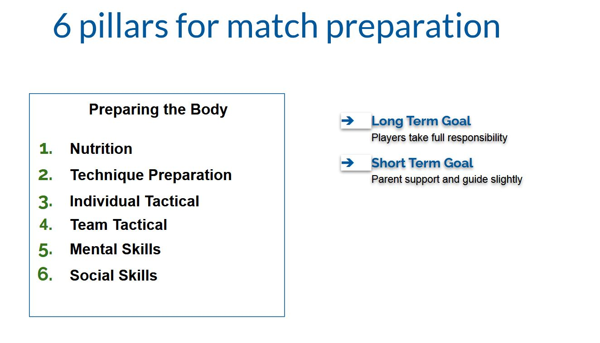
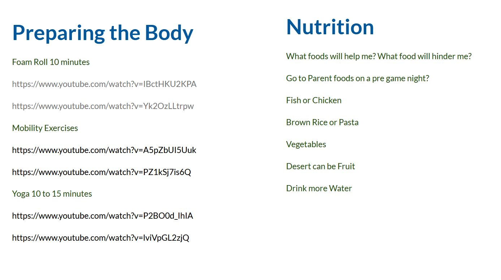
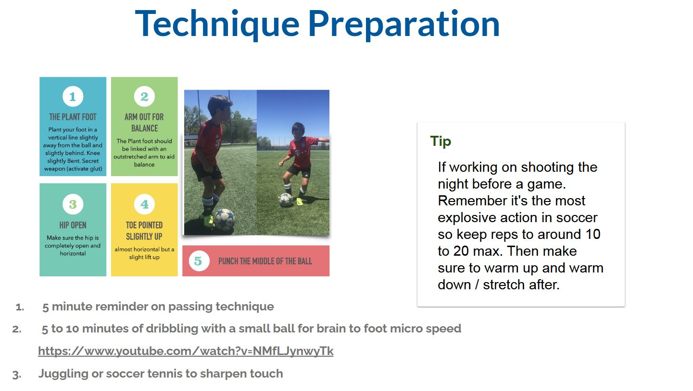
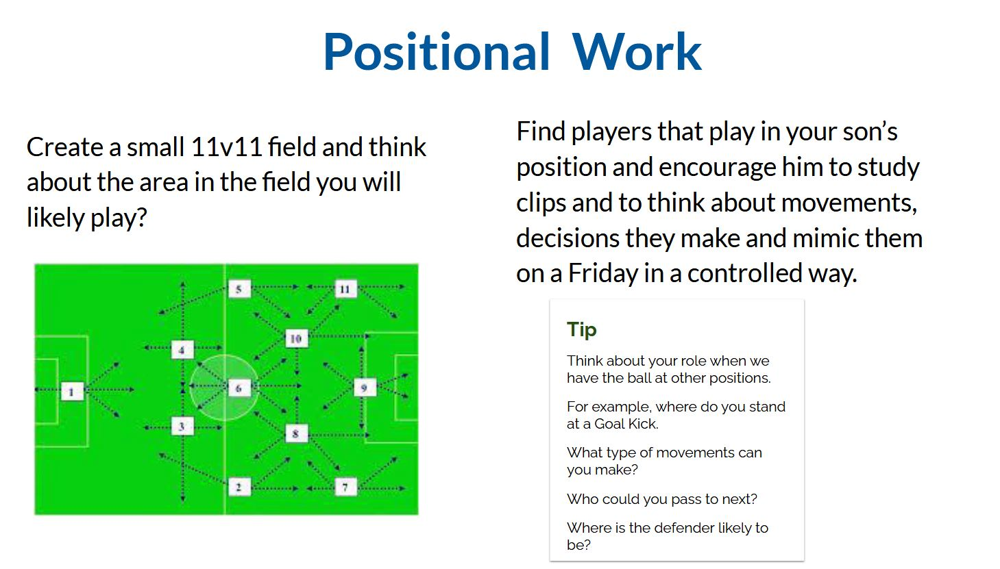
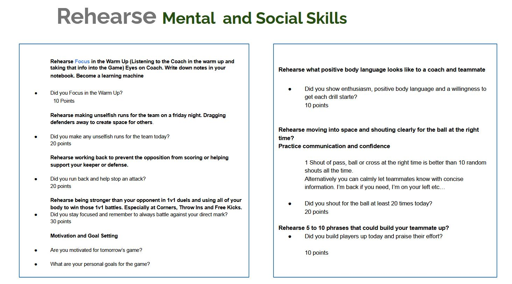
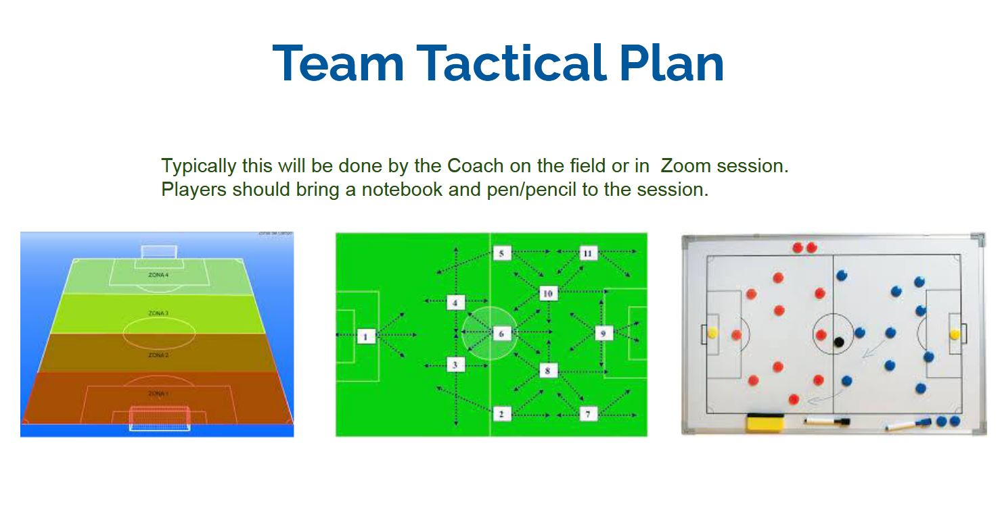
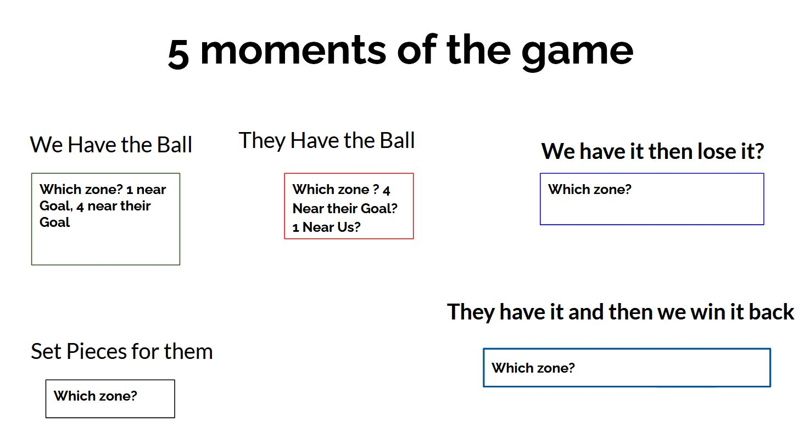
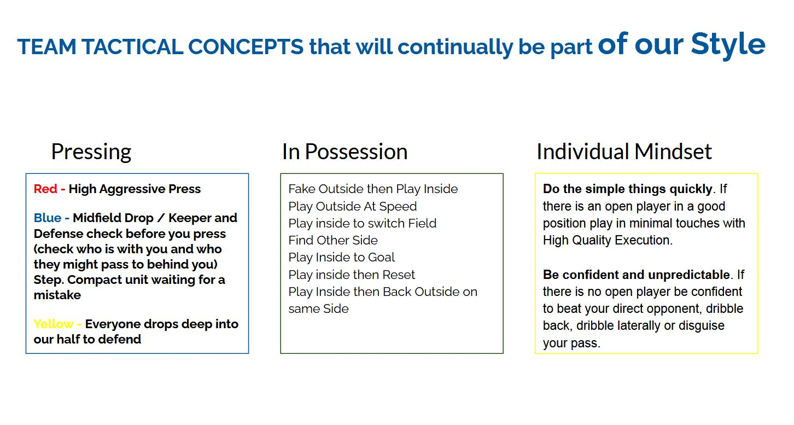
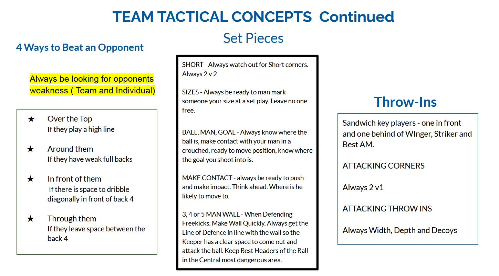

# Season 2021

## Match Preparation
- [AFC_Breakers_Match_Preparation_Print_Version.pdf](./docs/AFC_Breakers_Match_Preparation_Print_Version.pdf)

#### 6 Pillar for Match Preparion
- 

#### Preparing the Body / Nutrition
- Foam Roll 10 minutes 
	- https://www.youtube.com/watch?v=IBctHKU2KPA
	- https://www.youtube.com/watch?v=Yk2OzLLtrpw
- Mobility Exercises
	- https://www.youtube.com/watch?v=A5pZbUI5Uuk
	- https://www.youtube.com/watch?v=PZ1kSj7is6Q
- Yoga 10 to 15 minutes 
	- https://www.youtube.com/watch?v=P2BO0d_IhIA
	- https://www.youtube.com/watch?v=lviVpGL2zjQ
- 

#### Technique Preparation
- 5 to 10 minutes of dribbling with a small ball for brain to foot micro speed
	- https://www.youtube.com/watch?v=NMfLJynwyTk
- 

#### Positional Work
- 

#### Rehearse Mental & Social Skills
- 

#### Team Tactical Plan
- 

#### 5 moments of the game
- 

#### Team Tactical Concepts 1/2
- 

#### Team Tactical Concepts Cont 2/2
- 

## Rough Plan
- [Rough Plan](https://docs.google.com/document/d/1HwLKuzHWdzMY9hiNMNl-7k0UxkdKpG64pyDHFkBH2vA/edit)

### References / OTHER Pages
- [EST Galaxy Trip 08 2021](https://github.com/breakers-afc-mls-next/galaxy_trip_08_2021)
- [EST 2021 Season Prep](https://github.com/breakers-afc-mls-next/season_2021)
- [EST 2009 MLS Next Breakers Scrimmage 07/14/21](https://www.youtube.com/playlist?list=PLwqmavOE6xLNfzbzUYIs5UOKpTNIpONf_)
- [EST Manchester Cup 2021](https://github.com/breakers-afc-mls-next/manchestercup_2021)
